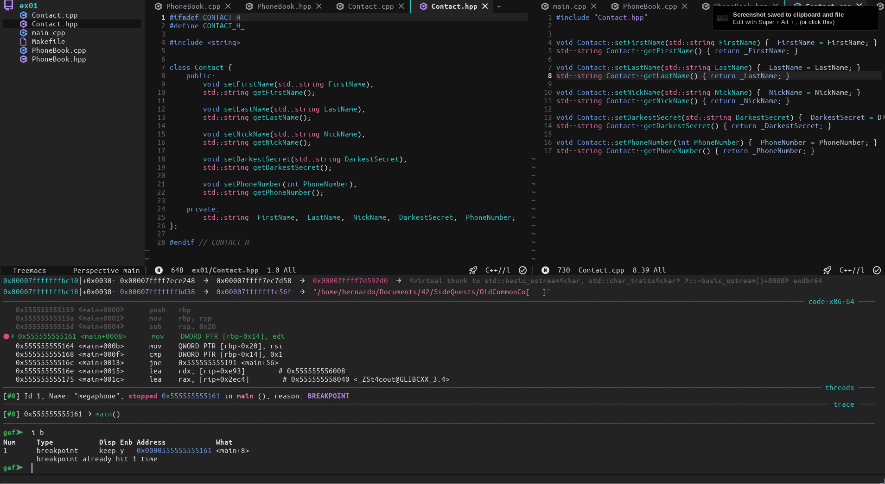

# oxocarbon-emacs

A high-contrast, accessibility-conscious port of the **Oxocarbon** theme for [Doom Emacs](https://github.com/doomemacs/doomemacs).


---

## 📸 Preview




---

## 📦 Installation

To install this theme manually, follow these steps:

### 1. Create the themes directory
If you haven't already, create the `themes` folder in your Doom configuration directory:

```bash
mkdir -p ~/.config/doom/themes/
# Or ~/.doom.d/themes/ depending on your setup   
```

### 2. Place the theme file
Download or clone the doom-oxocarbon-theme.el file and move it into the directory you just created:

```bash
mv doom-oxocarbon-theme.el ~/.config/doom/themes/
```

### 3. Configure Doom Emacs
Open your config.el file (located in ~/.config/doom/ or ~/.doom.d/) and add the following lines:

```bash
;; Add the custom themes directory to the load path
(add-to-list 'custom-theme-load-path (concat doom-user-dir "themes/"))

;; Set oxocarbon as the active theme
(setq doom-theme 'doom-oxocarbon)
```

> Note: Ensure you comment out or remove any previous lines setting doom-theme (e.g., (setq doom-theme 'doom-one)).
